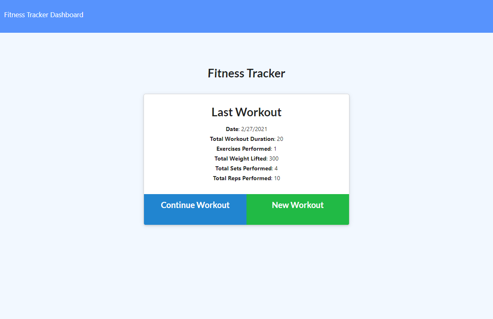

# Workout Tracker

## Table of Contents

* [Description](#description)
* [Installation](#installation)
* [Usage](#usage)
* [Credits](#credits)
* [License](#license)

## Description

Workout Tracker is an application that tracks the user's personal physical fitness routine. It uses Node.js, Express, MongoDB, and Mongoose. The landing page shows the user's last workout and some of it's metrics. The user can continue a previous workout or start a new workout. The Dashboard shows the user's metrics in various charts.

## Installation

`npm install`

## Usage

`node server.js`

## Credits

[Express](https://www.npmjs.com/package/express)

[MongoDB](https://www.mongodb.com/)

[Mongoose](https://www.npmjs.com/package/mongoose)

[Morgan](https://www.npmjs.com/package/morgan)

## License

[GNU General Public License v3.0](https://choosealicense.com/licenses/gpl-3.0/)